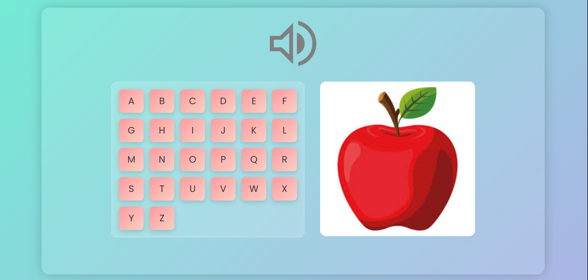

# ABC Sound & Image Learner 🔤🔊🍎

An interactive A–Z learning app for kids.  
Press any alphabet key (A to Z) — you'll hear the sound (like "Apple") and see the related image!

---

## 📸 Screenshot

```

```

---

## 🚀 Demo
Live link (after upload):  
`https://codeswithsidra.github.io/abc-learner/`

---

## 🔥 Features
- Play sound when you press a letter
- Show matching image (e.g., Apple for A)
- Fun and engaging for kids
- Works on desktop & mobile

---

## 🧰 Technologies Used
- HTML5
- CSS3
- JavaScript (Vanilla)

---

## 📂 How to Use
1. Clone/download this repo
2. Open `index.html` in browser
3. Press any key from A to Z
4. Make sure `sound/` and `images/` folders have A–Z files

---

## 💡 Best For
- Kids learning apps
- Educational websites
- Practice project for beginners

---

> Made with ❤️ by [Sidra](https://github.com/codeswithsidra)
